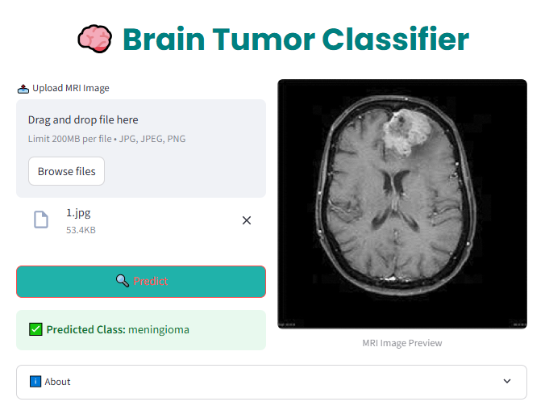

# 🧠 Brain Tumor MRI Image Classification

A Streamlit-based web application that uses a **ResNet-50** deep learning model to classify brain MRI images into four categories:

- **Glioma Tumor**
- **Meningioma Tumor**
- **No Tumor**
- **Pituitary Tumor**

This tool enables fast and accurate classification of brain tumors, helping healthcare professionals and researchers in diagnosis and decision-making.

---

## 📸 App Screenshots

| Upload MRI Image                                  | Classification Result                                  |
|---------------------------------------------------|--------------------------------------------------------|
|  |  |

---

## 🚀 Live Demo

👉 **[Try the Web App](#)**  
*(Streamlit deploy link)*

---

## 🛠 Features

- 📤 Upload MRI brain scan images in JPG/PNG
- 🔍 Predict brain tumor type using trained ResNet-50 model
- 🖼️ Real-time image preview
- ⚡ Fast inference using PyTorch
- 🧼 Clean, mobile-friendly UI layout

---

## 🧠 Model Overview

- Based on **ResNet-50** pretrained on ImageNet
- Final `fc` layer modified to output **4 classes**
- Trained on a labeled brain tumor MRI dataset
- Model saved as `resnet50_best.pt`

---

## 🖥️ Technologies Used

- [Streamlit](https://streamlit.io/)
- [PyTorch](https://pytorch.org/)
- [Torchvision](https://pytorch.org/vision/stable/index.html)
- [Pillow](https://python-pillow.org/)

---

## 🧪 How to Use the App

Using the Brain Tumor Classifier web app is simple and intuitive:

1. **Upload MRI Image**  
   - On the **left side** of the screen, click the **"📤 Upload MRI Image"** button.  
   - Select a brain MRI image file (`.jpg`, `.jpeg`, or `.png`) from your device.

2. **Preview the Image**  
   - Once uploaded, the selected image will automatically be displayed on the **right side** of the screen under **"MRI Image Preview"**.

3. **Make Prediction**  
   - After uploading the image, click the **"🔍 Predict"** button on the left.  
   - A loading spinner will appear while the model classifies the image.

4. **View Results**  
   - The predicted tumor class will be displayed below the button with a success message:
     ```
     ✅ Predicted Class: <tumor_type>
     ```
---

<h5 align="center">*Thanks for visiting! 🌟*</h5>